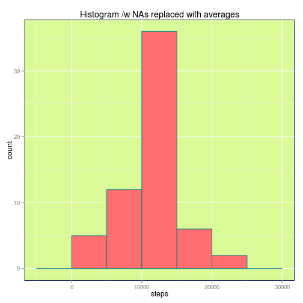

##Reproducible Research - Peer Assessment 1

by Sami Kallinen

###Loading and preprocessing the data

```r
# colorscheme
# http://paletton.com/#uid=3000u0kmJCgcCQQidJnrtx6vjqU

# libraries
library(dplyr)
library(scales)
library(ggplot2)
library(lubridate)

# load helper functions
downloadDataFromInternet <- function(url, file) {
        print("downloading data...")
        download.file(url, file, method = "curl")
        unzip(file, overwrite = T)
}

# set data sources and working directory
url <- "https://d396qusza40orc.cloudfront.net/repdata%2Fdata%2Factivity.zip" 
file <- "data.zip"
wd <- "~/Dropbox/Coursera/Reproducible Research/Assignments/RepData_PeerAssessment1"
datasource <- "activity.csv"

setwd(wd)
#downloadDataFromInternet(url, file)
rawdata <- tbl_df(read.csv(datasource))
```

###What is mean total number of steps taken per day?

For this part of the assignment, we are ignoring the missing values in the dataset.

1. Making a histogram of the total number of steps taken each day

```r
data_perday <- group_by(rawdata, date) %>%
         summarise(steps=sum(steps)) %>%
                 mutate(date=ymd(date))


ggplot(data_perday, aes(x=steps)) +
        geom_histogram(binwidth=5000,
                       colour="#038181",
                fill="#FF6E6E"
                ) +
                labs(title="Histogram of total number of steps each day")+
        theme(panel.background = element_rect(fill = '#D9FA97', 
                                             colour = '#0A224E'))
```

 

2. Calculating and reporting the mean and median total number of steps taken per day


```r
mean(data_perday$steps, na.rm = TRUE)
```

```
## [1] 10766.19
```


```r
median(data_perday$steps, na.rm = TRUE)
```

```
## [1] 10765
```

###What is the average daily activity pattern?

1. Making a time series plot (i.e. type = "l") of the 5-minute interval (x-axis) and the average number of steps taken, averaged across all days (y-axis)


```r
data_24h <- group_by(rawdata, interval) %>%
        summarise(steps=mean(steps, na.rm = T)) %>%
        mutate(time=sprintf("%04d", interval)) %>%
        mutate(time=sub( '(?<=.{2})', ':', time, perl=TRUE )) %>%
        mutate(time=as.POSIXct(time, format = "%H:%M"))

ggplot(data_24h, aes(time, steps)) +
        geom_line(colour="#038181",
                       fill="#FF6E6E",
                       lwd=.3) + 
                        labs(title="Average daily activity pattern")+
        theme(panel.background = element_rect(fill = '#D9FA97', 
                                              colour = '#0A224E')) +
        scale_x_datetime(labels = date_format("%H:%M"))
```

 
        
2. Which 5-minute interval, on average across all the days in the dataset, contains the maximum number of steps?

```r
max_steps <- max(data_24h$steps)
filter(data_24h, steps == max_steps)
```

```
## Source: local data frame [1 x 3]
## 
##   interval    steps                time
## 1      835 206.1698 2015-01-17 08:35:00
```


###Inputing missing values

Note that there are a number of days/intervals where there are missing values (coded as NA). The presence of missing days may introduce bias into some calculations or summaries of the data.

1. Calculating the total number of missing values in the dataset (i.e. the total number of rows with NAs)


```r
sum(is.na(rawdata))
```

```
## [1] 2304
```
2. Devicing a strategy for filling in all of the missing values in the dataset. The strategy does not need to be sophisticated.
Strategy deviced: use the previous dataset with avarage steps for each interval to fill in the missing values.

3- Creating a new dataset that is equal to the original dataset but with the missing data filled in.

```r
data_filledin <- rawdata
corresponding_mean <- function (x){
        as.numeric(filter(data_24h, interval == x) %>% select(steps))
}
data_filledin$steps <- mapply(rawdata$steps, 
                               rawdata$interval, 
                               FUN=function(x,y)
        ifelse(is.na(x), 
                corresponding_mean(y),
                x)
)
```

4. Make a histogram of the total number of steps taken each day and calculate and report the mean and median total number of steps taken per day. Do these values differ from the estimates from the first part of the assignment? 
What is the impact of imputing missing data on the estimates of the total daily number of steps?


```r
data_perday_filledin <- group_by(data_filledin, date) %>%
        summarise(steps=sum(steps, na.rm = T)) %>%
        mutate(date=ymd(date))

ggplot(data_perday_filledin, aes(x=steps)) +
        geom_histogram(binwidth=5000,
                       colour="#038181",
                fill="#FF6E6E"
                ) +
                labs(title="Histogram /w NAs replaced with averages") +
        theme(panel.background = element_rect(fill = '#D9FA97', 
                                              colour = '#0A224E'))
```

 
The number of 10-15K steps days increase noticeably.

Mean of total steps per day

```r
mean(data_perday_filledin$steps)
```

```
## [1] 10766.19
```
Median of total steps per day

```r
median(data_perday_filledin$steps)
```

```
## [1] 10766.19
```
The median and mean are now the same. These differ from the mean and median  up.

###Are there differences in activity patterns between weekdays and weekends?
1. Creating a new factor variable in the dataset with two levels – “weekday” and “weekend” indicating whether a given date is a weekday or weekend day.


```r
data_filledin <- mutate( data_filledin, date=ymd(date)) %>%
        mutate( weekday=ifelse(
                      weekdays(date) == "Saturday" | 
                              weekdays( date) == "Sunday",
                      "Weekend",
                      "Weekday") %>%
                      as.factor
              )
```
2. Making a panel plot containing a time series plot of the 5-minute interval (x-axis) and the average number of steps taken, averaged across all weekday days or weekend days (y-axis).

```r
ggplot(data_filledin, aes(interval, steps)) +
       stat_summary(fun.y="mean", 
                    geom="line",
                    colour="black",
                    binwidth=0.5, 
                    lwd=.3) +
        facet_grid(weekday ~ .) +
        labs(title="Average daily activity pattern weekdays and weekends") +
        theme(panel.background = element_rect(fill = '#D9FA97', 
                                              colour = '#0A224E'))
```

 

There is a clear difference in the plots, which implies that the routines are different on weekends and weekdays perhaps due to work or school.

Thank you for reading this far :)
